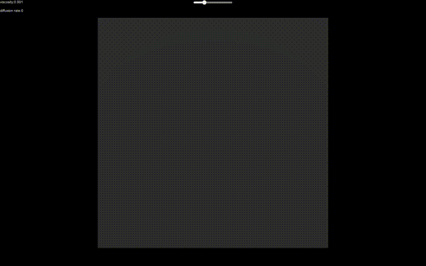
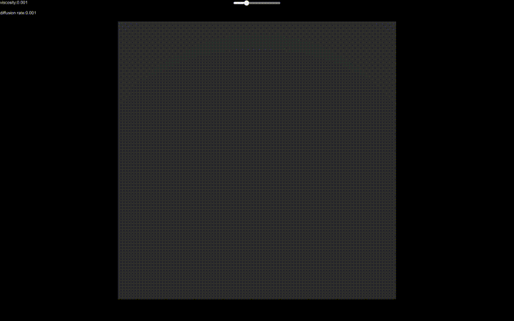

# UnityFluidDynamics

(Real-Time Fluid Dynamics for Games)[http://graphics.cs.cmu.edu/nsp/course/15-464/Spring11/papers/StamFluidforGames.pdf]  in Unity

**Extenesion**: Boost with ComputeShader or Unity Burst

## Results

|        2D Fluid        |              Velocity Visualization              | 3D with Volumetric Rendering |
| :--------------------: | :----------------------------------------------: | :--------------------------: |
|  |  |        |

