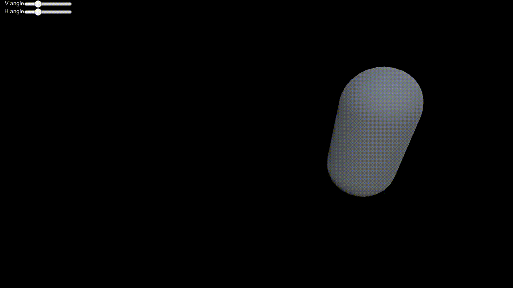

# UnityFluidDynamics

[Real-Time Fluid Dynamics for Games](http://graphics.cs.cmu.edu/nsp/course/15-464/Spring11/papers/StamFluidforGames.pdf)  in Unity

## Results

|        2D Fluid        |              Velocity Visualization              | 3D with Volumetric Rendering |
| :--------------------: | :----------------------------------------------: | :--------------------------: |
|  |  |        |

## Future work

- Accelerate the simulation with ComputeShader or Burst
- ~~Better shading (like Volumetric Cloud Shading etc.)~~

## Volumetric Cloud Rendering

Add in a post-processing volumetric rendering shader for 3D simulation result.

I modified the volumetric cloud shader (removing detailed noise, height gradient etc.)

the result is shown below

